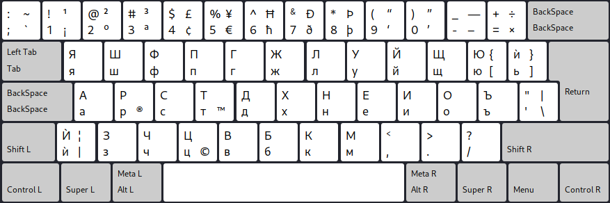

## Клавиатурната подредба Colemak за писане на българка кирилица



## Инсталиране в Линукс ОС

Първо трябва да свалите това гитхуб хранилище на вашия компютър. За целта трябва да инсталирате програма наречена "git".

В Убунту и Линукс Минт може да инсталирате "git" с командата `sudo apt install git`.
В Манджаро и Арч линукс може да инсталирате "git" с командата `sudo pacman -S git`.

След като имате инсталиран "git", изпълнете всяка от следните команди:

```fish
git clone --depth=1 https://github.com/salifm/colemak-bg
cd ./colemak-bg
sudo cp ./linux/symbols/bgc /usr/share/X11/xkb/symbols/bgc
sudo patch /usr/share/X11/xkb/rules/evdev.xml ./linux/rules/evdev.xml.patch
```

След това добавете новоинсталираната клавиатурна подредба "`Bulgarian (Colemak)`" към вашите клавиатурни подредби от настройките на вашата графична среда.

Ако не можете да я намерите пробвайте да рестартирате вашия компютър или поне излезте от профила си и влезте отново.

Готово!

Ако не успеете да се справите създайте "issue" към това хранилище.
